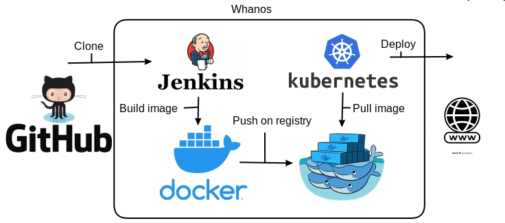

# Auto deployment

Basically, the auto deployment is a feature that allows you to deploy your project on a Kubernetes cluster without having to do anything.

The steps are pretty simple, jenkins clone your repository, build an image depending on few parameters and push it to the Google Artifact Registry. Then, it will deploy your project on the Kubernetes cluster.

## How it works ?

``` ascii
                    Whanos                                      Git
_________________________________________________
|                                                |  Clone
|                  Jenkins<----------------------|------- Your repository  
|                 /                              |
|                /                               |
|               /                                |
|              V                                 |
|           Docker ---> Build Image              |
|                            | Docker push image |
|                            V                   |
|               Docker Registry                  |
|                            ^                   |
|                Docker pull |----Kubernetes ----|--> Web
|                                                |
|________________________________________________|
```
Or image if you prefer 



So the Jenkins instance is cloning your repository, it finds the language of your project (c, python, java, javascript, befunge) and build an image to run your app. One it's done the image is pushed on a repository (Google Artifact Registry) and if the [whanos.yml](whanosyml_explain.md) file exist then it's deployed on the Kubernetes cluster.

<details>
<summary>In details</summary>
<h2>Jenkins</h2>
<p>Jenkins is auto deployed with configuration as code and job dsl, the jobs are automaticly instancied, you can see the file <a href="https://github.com/Touxooo/whanos/blob/master/jenkins/job_dsl.groovy">job_dsl.groovy</a> to have more details about the jobs. It use scm polling to check if you have changes on your repo. If you have changes or if it's the first time it will run a <a href="https://github.com/Touxooo/whanos/blob/master/jenkins/build.sh">bash script</a>.<br>This bash script detect the language, check if a dockerfile is at the root and build the coresponding image (standalone/base), once it has been build, the image is tagged with the good parameters for her to be pushed on the registry, and once it has been pushed the script detect if a whanos.yml file exist. If the file exists, he calls a <a href="https://github.com/Touxooo/whanos/blob/master/kubernetes/get_deployment.py">python script</a>.<br>This python script generate a deployment file using templates and the values of the whanos.yml file. after that it's just a kubectl apply and the application is now running on kubernetes and accesible if you want it.</p>
</details>