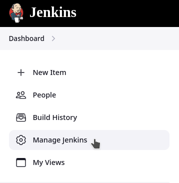
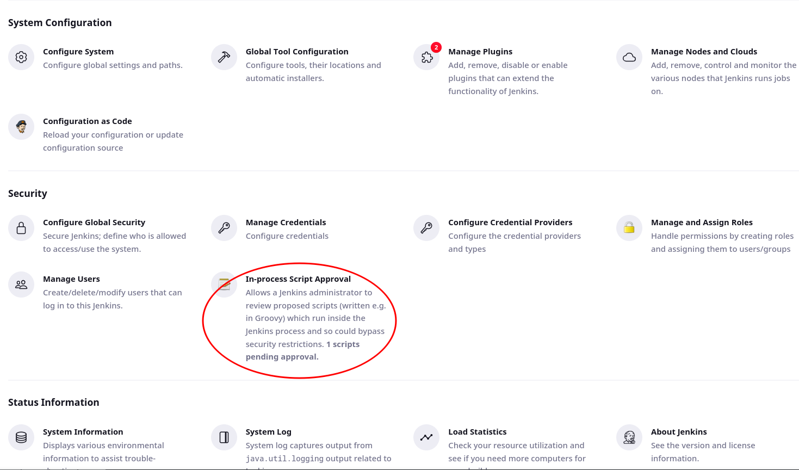
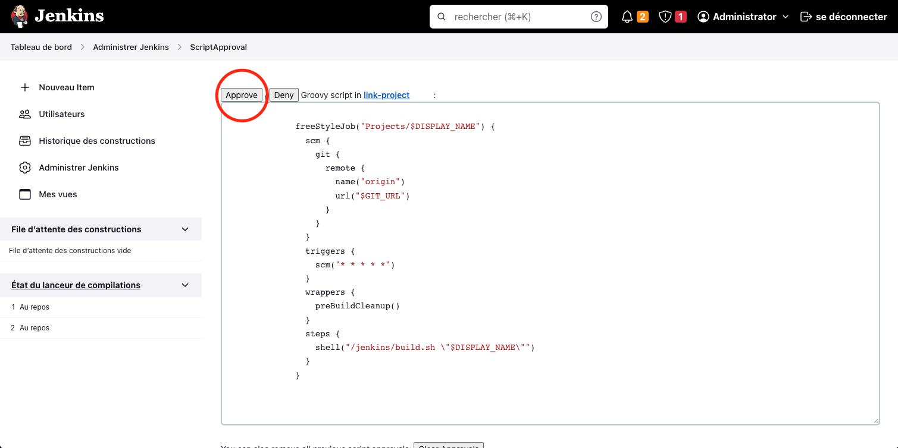
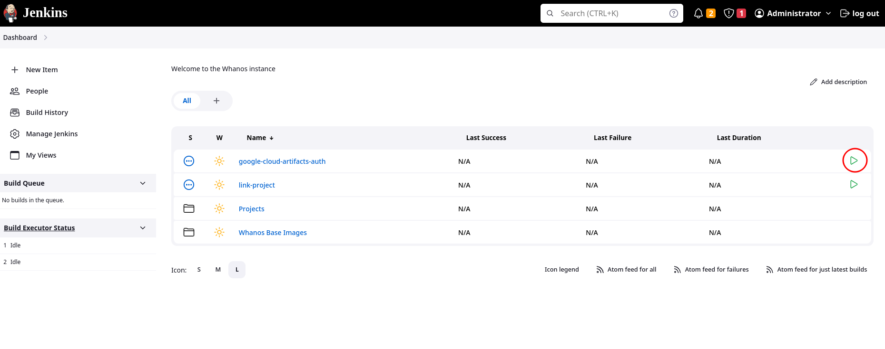
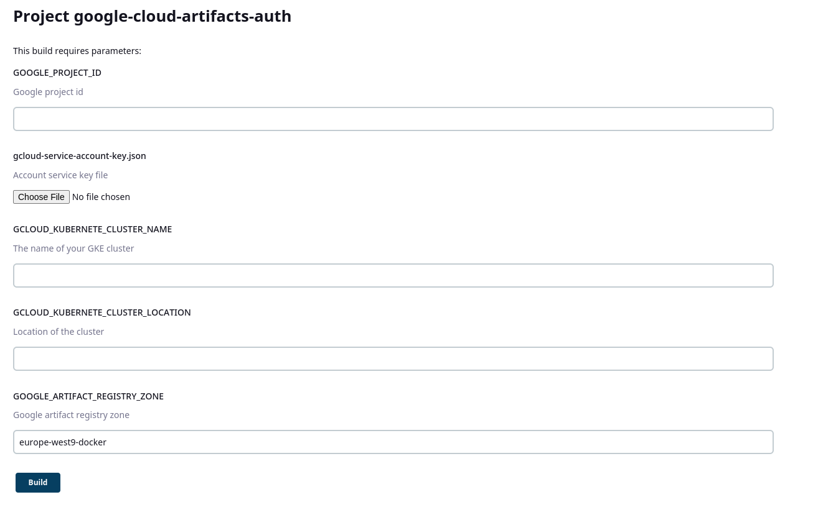

# Setup Whanos

## Prerequisites:
- [Install Whanos](install_whanos.md)
- [Accept the JobDSL](setup_whanos.md#step-1-accept-the-jobdsl)

## Setup Whanos
### Summary

### **Step 1: Accept the JobDSL**
To accept the JobDSL you need to go on the dashboard and click on **Administrate Jenkins** then go on **In Process Script Approval** and **accept** the script (see images below)  

### **Step 2: Login to Google Cloud Platform**
To start, you need to get the following elements:
- Google Cloud Platform (GCP) project ID ([link](https://console.cloud.google.com/home/dashboard))
- Service account key file (JSON format) (You already used one in the installation step, you can use the same) ([link](https://console.cloud.google.com/apis/credentials/serviceaccountkey))
- Google Kubernete Cluster Name ([link](https://console.cloud.google.com/kubernetes/list))
- Google Kubernete Cluster Location ([link](https://console.cloud.google.com/kubernetes/list))
- Google Artifact Registry Zone ([link](https://console.cloud.google.com/artifacts/docker/))

Now you can go on jenkins and run the job **google-cloud-artifacts-auth** and follow the instructions.  

  
  
Now fill with the list of element we've just seen above  

  

Once you done, you can use the differents Jobs :

## Link-Project
This job is used to link a project and deploy it if it have a [whanos.yml](whanosyml_explain.md) at the root of the repository. It will build an image and push it to the Google Artifact Registry.
## Whanos Base Images
This job is used to build the base images of Whanos.
## Whanos Base Images -> Build all base images
This job is used to build all the base images of Whanos.
## Projects
You will find here all the projects you've linked to Whanos and force run them, else at every change in the repo it will run itself.
  
  
## Deployment
If you are intereted in how your applications are deployed you can read this documentation [here](auto_deploy.md).